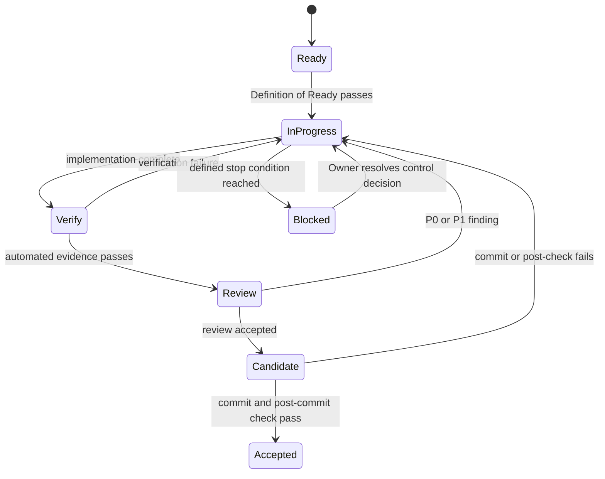

# MiniMax H3 Studio Orchestration v1

## 1. Purpose

This document tells Pi how to execute the rebaselined plan without drifting back to the former independent-frontend architecture or repeating R1's over-governed experiment loop. It controls checkpoint sequencing, evidence, review depth, commits, handoffs, and Owner stops.

The delivery plan defines **what** is built. This orchestration defines **how** Pi moves it safely from one accepted checkpoint to the next. Outside an Owner-approved checkpoint/formal task, Pi uses the project `simple` default: bounded change, proportional validation, concise Chinese summary, and no automatic fixed Round, handoff, Independent Review, or formal gate.

## 2. Governing Inputs

At every new session, read in this order:

1. `CONTEXT.md`
2. `docs/adr/0001-use-comfyui-as-studio-foundation.md`
3. `operations/planning/rebaseline-plan-v1.md`
4. this file
5. `operations/planning/initialization-plan.md` (Checkpoint Ledger)
6. `docs/specs/mvp-v0.md`, `docs/architecture/architecture-v0.md`, `docs/development/process.md`
7. `AGENTS.md`, `Harness_manual.md`, and the latest accepted work log/review
8. historical evidence only when the current checkpoint cites it

If a historical document conflicts with the first four items, the historical instruction is superseded. Preserve its evidence; do not execute its future plan.

## 3. Fixed Owner Decisions

Pi must not silently revisit these decisions:

- ComfyUI is the authoritative workflow foundation.
- The MVP uses native ComfyUI workflow/API formats.
- The project does not build a new canvas, DAG runtime, node registry, or application FIFO queue.
- Guided Mode is the default common path; the complete ComfyUI canvas remains available for advanced editing.
- Functional MVP acceptance is user-visible and end-to-end: frontend submission, observable execution, and playable video-plus-stereo-audio retrieval. Backend-only generation is not MVP acceptance.
- Functional MVP includes Replica Execution on at least two Workers.
- Single-Request Multi-GPU is a bounded experiment and does not block the functional product.
- Runtime Decision must prove one valid optimized ComfyUI path on A5000; Multi-Worker MVP closes performance acceptance.
- Single-Request Multi-GPU belongs to optional Track X and cannot block the four product checkpoints.
- Existing SGLang evidence is retained without making the historical 30.6-minute C3 probe the interactive default.

Changing any item requires an explicit Owner decision and a new or superseding ADR.

## 4. Roles

### Owner

Decides product goals, irreversible architecture, new authority, unsafe host changes, license/distribution posture, and final user-experience acceptance. The Owner does not manually drive ordinary fixes or reviews.

### Pi Orchestrator

Owns checkpoint scope, task ordering, evidence completeness, reviewer independence, state accuracy, and session handoff. Pi must prevent both scope expansion and false completion.

### Builder

Implements the smallest change set that satisfies the current checkpoint contract. The Builder must not preload later-checkpoint infrastructure or revive superseded architecture.

### Verifier

Runs mechanical checks and target-host probes appropriate to the change. It distinguishes content validity from mere process success.

### Reviewer

Challenges the change against the current source of truth, with review depth proportional to risk. It does not reopen accepted Owner decisions without new evidence.

## 5. Checkpoint State Machine



Only one delivery checkpoint is `in_progress`. A bounded spike or work package inside it is not a new checkpoint.

## 6. Per-Checkpoint Execution Loop

### Step 1 — Rehydrate

- verify current branch, HEAD, worktree state, Checkpoint Ledger, last work log, and last review;
- list existing uncommitted changes and preserve unrelated user work;
- restate current checkpoint goal, non-goals, safety limits, and expected evidence;
- run the anti-drift check in Section 8.

### Step 2 — Definition Of Ready

Do not implement until:

- prerequisites and external assets are present or explicitly part of the checkpoint;
- dependency and model downloads are bounded;
- destructive/system-level actions are absent or Owner-approved;
- testable acceptance conditions are written;
- rollback/cleanup behavior is known for GPU processes;
- the work fits the current checkpoint without hidden future-checkpoint obligations.

### Step 3 — Implement

- make the minimum cohesive change;
- pin external identities instead of following floating `latest` in accepted runtime paths;
- keep weights and runtime state outside Git;
- use supported ComfyUI extension/configuration mechanisms before considering a fork;
- do not create abstractions for hypothetical backends unless the current checkpoint has accepted evidence requiring them.

### Step 4 — Automated Verify

Run the smallest complete set:

- static/schema/config tests;
- unit/integration tests for project-owned control code;
- ComfyUI workflow validation or API-format load tests;
- frontend end-to-end submission, progress/status, and media retrieval checks for product checkpoints;
- process, port, path, and artifact-isolation checks;
- target-host media checks when the checkpoint generates video;
- clean Git-status and ignored-runtime checks.

A generated MP4 is not sufficient. Real H3 probes must validate terminal status, video stream, stereo audio stream, decode, duration, and representative frames against black/noise/corruption.

### Step 5 — Risk-Proportional Review

For an Owner-approved checkpoint or formal task, run the review class defined in Section 7. For ordinary simple/direct tasks, use proportional self-review and mechanical validation unless the Owner explicitly asks for formal review. P0 and P1 findings stay inside the current task/checkpoint and must be fixed and regression-verified. Do not invent extra checkpoints or substitute process gates for evidence.

### Step 6 — Candidate Closeout

Before committing:

- update work log and Checkpoint Ledger candidate status;
- record exact commands, runtime/model identities, evidence paths, and known limits;
- verify no runtime data or secrets are staged;
- create a scoped checkpoint commit;
- rerun fast post-commit checks;
- mark `accepted` only after commit and post-check succeed.

### Step 7 — Handoff

End every accepted or blocked checkpoint with:

- HEAD and worktree state;
- checkpoint status and why;
- changed files;
- verification and review summary;
- retained risks and constraints;
- exact next-checkpoint session prompt;
- any Owner decision required.

## 7. Review Classes

The former process applied heavyweight review to nearly every action and produced more governance than product. The new process uses three classes.

| Class | Applies to | Required review |
|---|---|---|
| A — Critical | model/runtime lock, GPU process control, host-memory safety, untrusted nodes, licenses, artifact deletion, controller concurrency | independent reviewer plus explicit P0/P1/P2 list and regression review |
| B — Product | Control Plane behavior, workflow templates, run/artifact metadata, Guided Mode extensions, recovery | automated tests plus focused reviewer; second review only after P0/P1 fixes |
| C — Routine | documentation, labels, styles, non-executable templates, operator copy | self-review plus mechanical checks; independent review only when source-of-truth meaning changes |

Baseline Reset is Class A because it changes the project's source of truth. Ordinary visual polish is not Class A.

### Review Scope Standard

Independent Review evaluates only whether the current active task / Round candidate satisfies the approved contract. The review bundle must separate:

- `candidate scope`：当前任务 / Round 请求验收的实际变更；reviewer may assign P0/P1/P2 to this scope.
- `context scope`：只读合同、Plan、spec、source、tests、baseline，用于判断 candidate；entering context does not make a file part of candidate scope.
- `environment / dirty-worktree scope`：Git dirty/untracked paths、pre-existing local files、tool directories and environment residue；used only for transparency, immutability evidence and contamination-risk assessment, not automatic candidate inclusion.

Entering a review bundle does not equal entering candidate scope. Git changed/untracked paths do not automatically enter the current product Round / task acceptance scope.

If a reviewer finds an issue outside the current candidate, classify it as exactly one of：当前产品阻塞、review evidence limitation、governance maintenance issue、非当前 task / Round backlog。Governance / harness / `.pi/` issues must not be treated as product candidate P1 fixes unless they directly make the required gate impossible.

`.pi/`、harness-flow、extensions、skills、prompts、settings、session handoff/review tooling are governance-layer files. Pi must not modify them during product development without explicit Owner authorization for a separate governance maintenance task. Tooling problems are recorded as governance maintenance issues or review limitations; do not auto-fix harness, and do not repeatedly reload or re-review merely to repair governance tooling.

Review artifacts should contain findings and decisions, not reproduce entire prompts, command transcripts, or unchanged documents.

## 8. Anti-Drift Check

Before implementation and before closeout, Pi must answer:

1. Does this change reuse ComfyUI semantics, or accidentally recreate them?
2. Is any new `WorkflowDocument`, DAG executor, node registry, queue, or graph UI being introduced?
3. Is the Control Plane coordinating Workers only, or becoming a second execution engine?
4. Are Replica Execution and Single-Request Multi-GPU being conflated?
5. Is a Draft/Balanced optimization being presented as quality-equivalent to the reference path without evidence?
6. Is a community claim being used as target-host acceptance evidence?
7. Is a failed multi-GPU experiment blocking work that the plan says is independent?
8. Is review effort proportional to the risk and product value of the change?
9. Has any superseded document regained normative authority through copy/paste or session handoff?

Any `yes` to questions 2, 3, 4, 6, 7, or 9 stops closeout until corrected.

## 9. Spike Contract

A spike answers one decision and leaves either accepted evidence or an explicit negative disposition.

Every spike must define:

- one question;
- fixed inputs and comparator;
- maximum attempts or configurations;
- time, disk, RAM, VRAM, and process cleanup limits;
- pass/fail evidence;
- what implementation becomes allowed after each outcome.

A spike must not become an unbounded implementation branch. Failed spikes do not create a new architecture automatically.

## 10. GPU And Runtime Safety

- Resolve exact GPU IDs before launch; do not rely on broad or unresolved environment variables.
- Pin `CUDA_VISIBLE_DEVICES`, port, output root, temp root, logs, and process identity per Worker.
- Establish host-RAM and GPU-memory abort thresholds below physical exhaustion.
- Stagger Worker startup until measured loading behavior proves concurrent startup safe.
- Kill only processes launched and recorded by the current orchestration; never use broad process-kill patterns.
- Verify delayed cleanup after cancellation, failure, timeout, and shutdown.
- Store model weights outside Git and record immutable hashes or repository revisions.
- Treat CUDA/PyTorch/comfy-kitchen/attention combinations as part of the model result identity on Ampere.
- Do not pass media that is black, pure noise, silent, corrupt, or missing one stream.

## 11. Worker-Pool Contract

The Worker Pool must provide:

- stable Worker identity and GPU binding;
- health and capability discovery;
- one owner for each accepted Run;
- safe concurrency limits based on RAM and runtime behavior;
- per-Run progress and artifact correlation;
- cancellation and failure propagation to the supported boundary;
- stale lease/process recovery;
- isolated output and temporary paths;
- an auditable scheduling decision.

Scheduling may be supplied by accepted SwarmUI behavior or project-owned thin coordination. It must not require a proprietary executable graph contract.

## 12. Git And Evidence Contract

- Do not mix source-of-truth rebaseline with runtime implementation in one commit.
- Do not amend or rewrite historical R1 evidence to change its meaning.
- Keep runtime outputs, databases, caches, environments, logs, downloaded frontend packages, models, and media ignored.
- Checkpoint commit messages identify the checkpoint and outcome.
- Ledger `accepted` status is effective only at the committed HEAD that contains its evidence.
- Evidence summaries link to retained files; avoid committing redundant copies of raw logs.
- If the worktree contains unrelated user changes, work around and preserve them.
- Treat dirty/untracked or pre-existing local files as environment scope unless the approved task explicitly includes them.
- Do not modify `.pi/`, harness-flow, extensions, skills, prompts, settings, or handoff/review tooling as part of a product candidate; record blockers or limitations separately.

## 13. Owner Stop Conditions

Stop and ask the Owner only when:

- a fixed decision in Section 3 must change;
- system driver, kernel, system CUDA, hardware, NVLink bridges, or host RAM must change;
- new full model families or large speculative downloads exceed the checkpoint budget;
- external distribution or a license-sensitive fork is proposed;
- two bounded runtime candidates both fail and the next choice changes the product plan;
- safety controls cannot keep GPU/host execution within defined limits;
- final profile thresholds require product trade-offs;
- final user-experience acceptance is ready.

Ordinary bugs, test failures, review findings, dependency fixes inside the lock budget, and documented fallback execution remain Pi's responsibility.

## 14. Status Report Format

Use this compact format:

```md
## Checkpoint
<name> — <ready | in_progress | blocked | accepted>

## Outcome
<what is now true>

## Evidence
- <tests/probes/reviews>

## Constraints
- <remaining known limits>

## Git
- HEAD: <sha>
- Worktree: <state>

## Next
<one exact next action or Owner decision>
```
