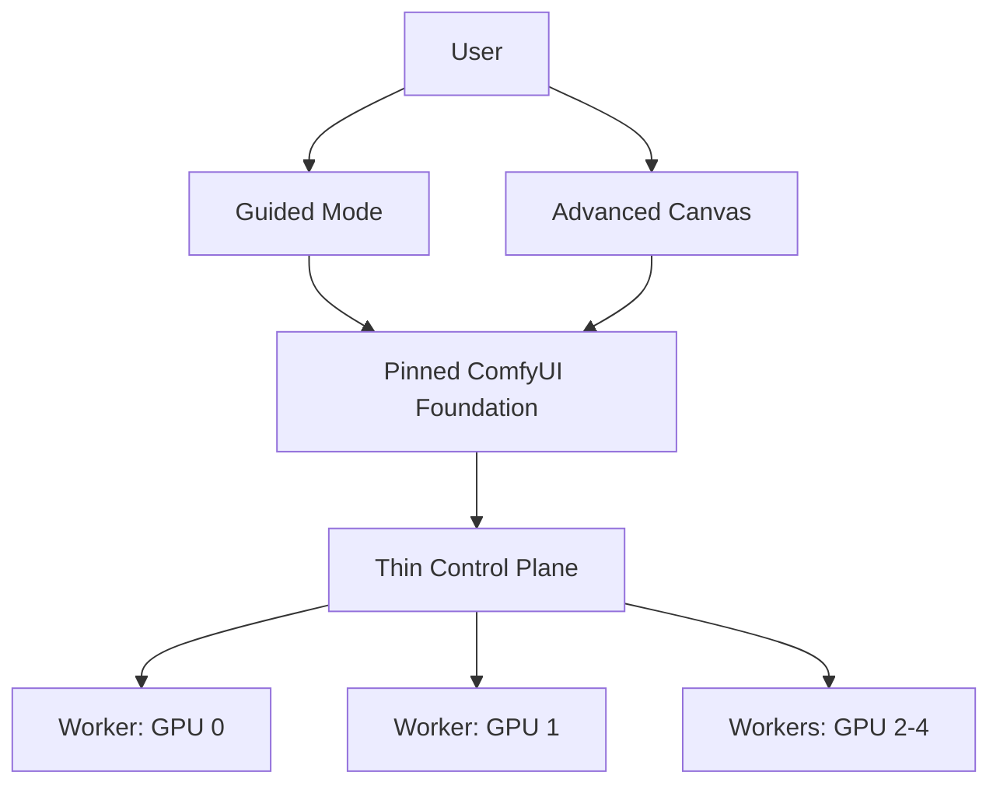

# MiniMax H3 Studio Rebaseline Plan v1

Plan approval: approved
Git baseline: b532a55f4549a2177ecd95237a4f3510cfb0aec5
Accepted-effective Rounds: R1, R2, R3

## Control Header

- Status: `approved`
- Active Round: `R4` — Multi-Worker MVP
- Owner decision date: 2026-08-28
- Repository: `lwx0218/minimax-h3-workflow-studio`
- Audited Git HEAD: `b532a55f4549a2177ecd95237a4f3510cfb0aec5`
- Architecture decision: `docs/adr/0001-use-comfyui-as-studio-foundation.md`
- Canonical language: `CONTEXT.md`
- Execution contract: `operations/planning/orchestration-v1.md`

This plan replaces the product and delivery assumptions in the former R2-R7 plan. It does not preserve that round count, and it does not erase the earlier R1 evidence. The first Pi session after receiving this package is a documentation-only rebaseline checkpoint; implementation resumes only after the repository itself contains the new source of truth and the old normative documents are marked superseded.

## 1. Goal

Deliver a local, single-user MiniMax H3 Studio that:

1. Reuses the mature ComfyUI graph editor, node system, queue, execution engine, progress protocol, and memory-management capabilities.
2. Provides a guided H3 generation experience and an advanced ComfyUI canvas.
3. Generates valid H3 video with native stereo audio on the target 5×RTX A5000 host.
4. Uses at least two GPUs concurrently through independent Workers before MVP acceptance.
5. Preserves a bounded path to Single-Request Multi-GPU without making that experiment a product-development blocker.

## 2. Non-Goals

The MVP will not:

- build or maintain an independent graph canvas;
- define a parallel executable WorkflowDocument or proprietary DAG runtime;
- reproduce ComfyUI's node registry, queue, PromptExecutor, HTTP API, or WebSocket protocol;
- guarantee compatibility with arbitrary third-party custom nodes;
- fork and strip ComfyUI before measured product experience demonstrates a need;
- require TP2/TP4/Ulysses generation to succeed before the functional product can ship;
- treat community performance claims as target-host acceptance evidence;
- expose authentication, quotas, multi-tenancy, or public-internet deployment.

## 3. Source-Of-Truth Precedence

After the rebaseline commit, Pi must read and resolve conflicting instructions in this order:

1. `CONTEXT.md`
2. accepted ADRs in `docs/adr/`
3. this plan
4. `operations/planning/orchestration-v1.md`
5. `operations/planning/initialization-plan.md` (Checkpoint Ledger)
6. the updated MVP spec, architecture and development process
7. updated `AGENTS.md` and `Harness_manual.md`
8. latest work log/review; historical R1 plans, reviews, work logs, and evidence only record executed facts

Historical evidence remains authoritative about what was actually executed. Historical plans are not authoritative about future product architecture.

## 4. Baseline Disposition

### Preserve

- R1 attempt manifest, logs, verification scripts, media checks, dependency locks, and review artifacts.
- the historical C3 attempt as a valid `feasible_with_constraints` single-card SGLang probe.
- Four-card evidence showing NCCL P2P failure, successful P2P-disabled collectives, repeated CPU checkpoint staging, and the 251 GiB host-RAM boundary.
- Weight, artifact, secret, path, Git-ignore, safety-abort, and traceability rules.
- The separation between Replica Execution and Single-Request Multi-GPU.

### Supersede

- R1 status `blocked` solely because TP4 did not generate a video.
- The rule that R2 cannot begin before four-card single-request inference succeeds.
- Independent WorkflowDocument, Node Registry, ExecutionPlan, DAG Executor, and frontend-canvas deliveries in the former R2-R4 plan.
- Single-concurrency FIFO as the long-term application execution model.
- The statement that ComfyUI is only a visual reference or optional fallback backend.
- The plan to build a new H3Backend abstraction before validating ComfyUI's native H3 path.

### Do Not Delete

Old documents and evidence are part of the audit trail. Add clear `SUPERSEDED` banners and links to this plan; do not rewrite old experiment results to make them appear consistent with the new decision.

## 5. Target Shape

The Control Plane coordinates Workers; it does not interpret or execute the graph independently of ComfyUI.

## 6. Generation Profiles

These are initial product hypotheses, not accepted performance claims. Runtime Decision records the first target-host evidence; Multi-Worker MVP freezes the thresholds.

| Profile | Intent | Initial candidate | Disclosure rule |
|---|---|---|---|
| Draft | rapid iteration | approximately 864×480, Turbo 8-step or equivalent approved acceleration | approximate weights, attention, cache, and LoRA must be explicit |
| Balanced | normal interactive use | pruned INT8 ConvRot DiT, quantized text encoder, 20-25 steps, approximately 864×480 | must retain a quality comparator and content validation |
| Final | high-quality output | near 768p, 20-25 steps initially; non-quantized route remains a candidate | do not label quantized/pruned output lossless |
| Reference | offline comparison | existing official-weight historical C3 evidence or a later reproducible comparator | not exposed as the default interactive profile |

Provisional Multi-Worker MVP targets for a five-second output are Draft ≤5 minutes, Balanced ≤10 minutes, and Final ≤20 minutes after warm-up. They are not Runtime Decision blockers and may be revised only with recorded target-host evidence and Owner approval.

## 7. Delivery Checkpoints

The new plan uses four numbered named checkpoints. They are the only acceptance-bearing delivery units and are not aliases for the former R1-R7 sequence.

| Round | Primary implementation session | Independently reviewable delivery boundary | Acceptance evidence | Status |
|---|---|---|---|---|
| R1 | R1-baseline-reset | Repository instructions agree on the ComfyUI-first architecture | docs; conflict scan; review; checkpoint commit | accepted |
| R2 | R2-runtime-decision | One reproducible optimized H3 route works on A5000 and the controller direction is decided | valid cold/warm media probe; pinned stack; SwarmUI disposition | accepted |
| R3 | R3-single-worker-product | One user can author and run T2VA/FL2VA through Guided Mode or Advanced Canvas | controlled Distribution; valid workflows; traceable Runs and Artifacts | accepted |
| R4 | R4-multi-worker-mvp | Independent Runs use multiple A5000 Workers safely and the product meets MVP acceptance | two concurrent valid Runs; five-GPU pool readiness; recovery/profile/packaging evidence | pending |

Historical R1 is closed during Baseline Reset as `accepted / feasible_with_constraints`; it is evidence disposition, not an additional future checkpoint.

Single-Request Multi-GPU is Track X, an optional post-MVP experiment. It is not a hidden fifth product checkpoint and cannot block the four-checkpoint product path.

No implementation checkpoint begins until Baseline Reset is committed and its post-commit checks pass. Within later checkpoints, Pi may make small recovery commits, but may not invent lettered sub-rounds or change the checkpoint outcome.

## 8. Checkpoint Contracts

## R1 — Baseline Reset

- Handoff contracts: `CONTEXT.md`; `docs/adr/0001-use-comfyui-as-studio-foundation.md`; `operations/planning/rebaseline-plan-v1.md`; `operations/planning/orchestration-v1.md`; `operations/planning/initialization-plan.md`
- Latest work log: `operations/work_logs/2026-08-28-baseline-reset.md`
- Latest review: `operations/reviews/2026-08-28-baseline-reset-review.md`
- Review work log: `operations/work_logs/2026-08-28-baseline-reset.md`
- Non-goals: ComfyUI installation; weight download; GPU experiment; product implementation; old R2-R7 continuation
- Dependencies / Definition of Ready: Owner-approved ComfyUI-first decision; audited baseline HEAD; package files available; historical R1 evidence retained
- Expected change surfaces: source-of-truth Markdown; checkpoint Ledger; documentation verifier; review and work log
- Exact validation strategy: documentation link and consistency verifier; retained R1 verifier; diff whitespace check; independent read-only documentation review; staged candidate boundary check
- Independent Review mode: spawned_pi_process
- Round review: `operations/reviews/2026-08-28-baseline-reset-review.md`
- Final integrated review: `operations/reviews/2026-08-28-r1-final-integrated-review.md`
- Acceptance evidence: docs; conflict scan; review; checkpoint commit
- Exact next gate: R2 — Runtime Decision
- Blockers / assumptions: historical R1 result is preserved as evidence; no product implementation is authorized in R1
- Blocked / rebaseline conditions: Owner changes ComfyUI foundation; preservation of historical evidence becomes impossible; commit or post-commit verification fails

Scope:

- add `CONTEXT.md` and ADR-0001;
- add this plan, the orchestration contract, and the Pi handoff;
- update README, intake, MVP spec, architecture, Master Plan/Checkpoint Ledger (`operations/planning/initialization-plan.md`), `AGENTS.md`, and `Harness_manual.md` to point to the new source of truth;
- mark incompatible future-plan sections as superseded;
- change R1 from `blocked` to `accepted / feasible_with_constraints` while preserving the four-card experimental result;
- replace the former R2-R7 ledger with the four named checkpoints;
- set Runtime Decision as the next executable checkpoint.

Not allowed:

- installing ComfyUI;
- downloading new model weights;
- running new GPU experiments;
- creating product implementation code;
- deleting or rewriting R1 evidence.

Acceptance:

- no normative file still instructs Pi to build an independent canvas, WorkflowDocument, DAG Executor, or FIFO application queue;
- no normative file still blocks Runtime Decision on TP4 success;
- all superseded documents point to the new plan;
- repository validation and independent documentation review pass;
- a dedicated rebaseline checkpoint commit is created and post-commit verified.

### Historical R1 — Evidence Disposition

R1 is not rerun. Its accepted conclusion is:

- local H3 generation is feasible with constraints;
- the historical C3 attempt is valid evidence for an official-weight, online-INT8, single-card reference route;
- that attempt's approximately 30.6-minute generation is not accepted as the interactive product baseline;
- Single-Request Multi-GPU on this host remains unproven and moves to optional Track X;
- the current host has five A5000 cards, no active NVLink topology, unusable default NCCL P2P under the tested lock, and a 251 GiB RAM constraint.

## R2 — Runtime Decision

- Handoff contracts: `CONTEXT.md`; `docs/adr/0001-use-comfyui-as-studio-foundation.md`; `operations/planning/rebaseline-plan-v1.md`; `operations/planning/orchestration-v1.md`; `operations/planning/initialization-plan.md`; `docs/specs/mvp-v0.md`; `docs/architecture/architecture-v0.md`; `Harness_manual.md`
- Latest work log: `operations/work_logs/2026-08-28-baseline-reset.md`
- Latest review: `operations/reviews/2026-08-28-baseline-reset-review.md`
- Review work log: `operations/work_logs/2026-08-28-baseline-reset.md`
- Non-goals: Guided Mode implementation; Control Plane implementation; Multi-Worker product code; Single-Request Multi-GPU; broad sampler or quantization matrix
- Dependencies / Definition of Ready: R1 Baseline Reset accepted; target A5000 host available; model asset identity recorded; bounded disk/RAM/VRAM limits defined; no unapproved system changes
- Expected change surfaces: runtime manifests; project-local launch/configuration docs; runtime evidence; controller spike disposition; Runtime Decision work log and review
- Exact validation strategy: target-host DoR; one cold and one warm ComfyUI H3 probe; media ffprobe/decode/content checks; resource and process cleanup checks; SwarmUI bounded controller spike; documentation and Git boundary checks
- Independent Review mode: spawned_pi_process
- Round review: `operations/reviews/2026-08-28-r2-runtime-decision-review.md`
- Final integrated review: `operations/reviews/2026-08-28-r2-final-integrated-review.md`
- Acceptance evidence: valid cold/warm media probe; pinned stack; SwarmUI disposition
- Exact next gate: R3 — Single-Worker Product
- Blockers / assumptions: one primary stack plus at most one correction; fallback requires bounded disposition; target-host evidence outranks community claims
- Blocked / rebaseline conditions: two bounded runtime candidates fail; safety limits cannot be enforced; required model assets exceed budget; Owner architecture or hardware decision is required

Purpose: select the product runtime before packaging it.

Primary probe:

- one A5000;
- pinned ComfyUI backend and frontend candidates;
- pinned PyTorch/CUDA and `comfy-kitchen` candidates, beginning with an Ampere-compatible cu130 path supported by successful public evidence;
- pruned INT8 ConvRot H3 DiT plus a compatible quantized text encoder and approved VAEs;
- approximately 864×480, 124 frames, 20-25 steps;
- one cold and one warm generation with identical geometry and declared settings;
- record hashes, versions, launch flags, VRAM/RAM peaks, load time, generation time, ffprobe video/audio, full decode, and first/middle/last-frame content checks.

Bounds:

- one primary stack and at most one version/configuration correction;
- if still invalid, one fallback probe using DiffSynth NF4 or another already-assessed low-memory runtime;
- do not tune a broad sampler/quantization matrix;
- do not download multiple speculative weight families.

Controller spike:

- test whether current SwarmUI can preserve the required H3 workflow-authoring experience while distributing independent Runs across multiple ComfyUI backends;
- test only workflow submission, worker selection, progress, artifacts, and failure reporting;
- if it passes, adopt and pin it;
- if it fails, record why and choose a thin project-owned Control Plane using ComfyUI HTTP/WebSocket contracts;
- do not extend or fork SwarmUI during the spike.

Acceptance:

- at least one valid ComfyUI H3 output on A5000;
- stack identity and reproducible command recorded;
- cold/warm timing recorded without declaring final thresholds;
- controller route decided as `adopt_swarmui` or `build_thin_control_plane`;
- quality/content validation prevents black/noise media from passing.

## R3 — Single-Worker Product

- Handoff contracts: `CONTEXT.md`; `docs/adr/0001-use-comfyui-as-studio-foundation.md`; `operations/planning/rebaseline-plan-v1.md`; `operations/planning/orchestration-v1.md`; `docs/specs/mvp-v0.md`; `docs/architecture/architecture-v0.md`
- Latest work log: `operations/work_logs/2026-09-02-r3-single-worker-product.md`
- Latest review: `operations/reviews/2026-08-28-r3-final-integrated-review.md`
- Review work log: `operations/work_logs/2026-09-02-r3-single-worker-product.md`
- Non-goals: custom canvas; independent graph runtime; arbitrary third-party nodes; multi-worker scheduling; Track X
- Dependencies / Definition of Ready: R2 accepted; pinned runtime decision; approved asset manifest; clean-session start path; mock/no-GPU validation boundary
- Expected change surfaces: controlled Distribution; native workflow templates; Guided Mode; Advanced Canvas settings/extensions; Run and Artifact traceability
- Exact validation strategy: clean start; configuration/schema checks; native workflow load; frontend submission/progress/media retrieval; T2VA and FL2VA end-to-end evidence; Git/portability checks
- Independent Review mode: spawned_pi_process
- Round review: `operations/reviews/r3-single-worker-product-review.md`
- Final integrated review: `operations/reviews/2026-08-28-r3-final-integrated-review.md`
- Acceptance evidence: controlled Distribution; valid workflows; traceable Runs and Artifacts
- Exact next gate: R4 — Multi-Worker MVP
- Blockers / assumptions: ComfyUI remains pinned and authoritative; only supported extension/configuration mechanisms are used
- Blocked / rebaseline conditions: runtime route is invalid; clean product session cannot start; required product path needs an architecture change

This checkpoint combines Distribution bootstrap and the first product vertical slice because neither is independently valuable to the user.

Work package A — Controlled Distribution:

- pinned upstream identities and dependency lock;
- reproducible project-local install/start commands;
- approved model/asset manifest with hashes and external storage paths;
- T2VA and FL2VA workflow templates in native ComfyUI formats;
- H3 Generation Profile configuration;
- custom node and extension allowlist;
- ignored runtime directories and environment template;
- Mock or no-GPU checks for configuration and workflow shape.

Work package B — User flow:

- Guided Mode for common H3 inputs and outputs;
- Advanced Canvas entry using the full pinned ComfyUI frontend;
- submit, progress, cancel where supported, preview, and artifact retrieval;
- Run snapshot and artifact traceability;
- one valid T2VA and one valid FL2VA path.

Do not fork the frontend. Use workflow templates, App Mode, settings, and supported extensions.

Acceptance requires a clean session to prepare and start the controlled Distribution, then submit and complete both valid workflows from Guided Mode or Advanced Canvas. The user must see progress/status and be able to preview or retrieve the resulting video with stereo audio. Direct CLI or backend-API generation is supporting evidence only.

## R4 — Multi-Worker MVP

- Handoff contracts: `CONTEXT.md`; `docs/adr/0001-use-comfyui-as-studio-foundation.md`; `operations/planning/rebaseline-plan-v1.md`; `operations/planning/orchestration-v1.md`; `docs/specs/mvp-v0.md`; `docs/architecture/architecture-v0.md`
- Latest work log: `none`
- Latest review: `none`
- Review work log: `operations/work_logs/`
- Non-goals: Single-Request Multi-GPU as an MVP gate; public deployment; arbitrary nodes; frontend fork
- Dependencies / Definition of Ready: R3 accepted; two isolated Worker identities; measured host-RAM concurrency limit; recovery and artifact namespace design
- Expected change surfaces: Worker lifecycle; Control Plane or accepted SwarmUI route; Run scheduling/status; Artifact correlation; recovery/operations docs; final acceptance report
- Exact validation strategy: two concurrent frontend-submitted independent Runs; five-Worker discovery and queued work; progress/artifact correlation; failure/cancel/restart cleanup; profile matrix; security/license/packaging regression
- Independent Review mode: spawned_pi_process
- Round review: `operations/reviews/r4-multi-worker-mvp-review.md`
- Final integrated review: `operations/reviews/2026-08-28-r4-final-integrated-review.md`
- Acceptance evidence: two concurrent valid Runs; five-GPU pool readiness; recovery/profile/packaging evidence
- Exact next gate: Final Owner acceptance after final-integrated review
- Blockers / assumptions: concurrency is bounded by measured host RAM; Replica Execution and Single-Request Multi-GPU use separate evidence
- Blocked / rebaseline conditions: safe concurrency cannot be established; two independent Runs cannot complete; distribution/license boundary changes

Work package A — Replica Execution:

- two isolated Workers bound to two distinct A5000s;
- isolated ports, temporary paths, logs, output namespaces, and process lifecycle;
- a Control Plane or accepted SwarmUI route that assigns two independent Runs concurrently;
- progress and artifact correlation per Run;
- fail-closed behavior when no suitable Worker is available.

Acceptance for this package requires two Runs submitted through the product surface, visibly correlated with their status and Artifacts, and completed concurrently as valid video-plus-audio outputs on two Workers. Moving model components between two GPUs for one request does not satisfy it.

Work package B — Five-GPU operations:

- discovery and health for all five Workers;
- bounded concurrency based on measured host RAM, not simply GPU count;
- crash cleanup, stale-lease recovery, retry policy, cancellation, and controlled shutdown;
- run/history index and artifact cleanup policy;
- protection against host-memory exhaustion when multiple Workers offload simultaneously.

Five simultaneous H3 generations are not required if measured RAM makes that unsafe. All five GPUs must be addressable over queued work while the controller respects a proven safe concurrency limit.

Work package C — MVP closure:

- Draft/Balanced/Final profile quality and performance matrix on A5000;
- cold start, warm latency, aggregate throughput, RAM/VRAM peaks, and failure-rate evidence reported separately;
- explicit disclosure of pruned, quantized, Turbo, cache, and approximate-attention behavior;
- full regression, security boundary, license inventory, packaging, and operator documentation;
- final product acceptance report.

### Track X — Optional Single-Request Multi-GPU

Track X may start only after Multi-Worker MVP is accepted or during idle capacity when it cannot delay the four-checkpoint product path:

1. record `nvidia-smi nvlink -s`, `nvidia-smi topo -m`, P2P matrix, and bounded NCCL tests;
2. test at most TP2 and one four-GPU legal topology with pinned, source-supported configurations;
3. compare valid media, host/GPU peaks, load time, and generation time against the matching single-card comparator;
4. stop if no valid output is produced, a safety limit is crossed, or there is no material benefit;
5. record `unsupported_on_current_host` without reopening or blocking Functional MVP acceptance.

## 9. Final MVP Acceptance

MVP is accepted only when all are true:

1. From Guided Mode, a user can configure and submit H3 generation, observe status/progress, and preview or retrieve the final media.
2. From Advanced Canvas, native ComfyUI H3 Workflows can be saved, loaded, edited, submitted, and completed.
3. At least one T2VA and one FL2VA Run initiated from the product frontend generate valid playable video with stereo audio.
4. At least two Workers execute independent Runs concurrently.
5. All five A5000s can participate in the Worker Pool over queued work, subject to a measured safe concurrency limit.
6. Every Run records workflow/API snapshot, profile, model/runtime identity, seed, timing, status, and artifacts.
7. Cancellation, failure, cleanup, and restart behavior are documented and tested to the supported boundary.
8. Draft, Balanced, and Final evidence is published; final performance thresholds are accepted by the Owner.
9. Arbitrary third-party nodes and untrusted executable workflow fields are not enabled by default.
10. Model weights, runtime data, secrets, caches, logs, and generated media remain out of Git.
11. The license inventory distinguishes upstream ComfyUI GPL components, project-owned code, model licenses, and third-party model assets.
12. README and operator docs provide reproducible start, recovery, and known-limit instructions.

Single-Request Multi-GPU success is desirable but is not item 13.

Backend CLI/API probes remain required engineering evidence, but they cannot substitute for items 1-3.

## 10. Change Control

Owner approval is required to:

- replace ComfyUI as the Studio foundation;
- introduce a proprietary executable workflow format;
- fork the ComfyUI frontend;
- enable arbitrary third-party node installation;
- change the requirement for at least two concurrent Workers;
- make Single-Request Multi-GPU a blocking MVP gate;
- modify system driver, kernel, system CUDA toolkit, hardware topology, or host RAM;
- distribute modified GPL components externally.

All other bounded implementation choices belong to Pi within the orchestration contract.

## 11. Evidence References

- Current repository head: https://github.com/lwx0218/minimax-h3-workflow-studio/commit/b532a55f4549a2177ecd95237a4f3510cfb0aec5
- Existing R1 report: https://github.com/lwx0218/minimax-h3-workflow-studio/blob/main/operations/reviews/2026-08-21-r1-feasibility-report.md
- ComfyUI server routes: https://docs.comfy.org/development/comfyui-server/comms_routes
- ComfyUI custom-node model: https://docs.comfy.org/custom-nodes/overview
- ComfyUI official H3 support: https://blog.comfy.org/p/minimax-h3-day-0-support-in-comfyui
- Reproducible RTX 3060 H3 evidence: https://github.com/Sunwood-ai-labs/minimax-h3-experiment-lab/blob/main/runtime/3060/benchmark/index.md
- MiniMax official deployment examples: https://github.com/MiniMax-AI/MiniMax-H3#sglang-deployment
- SGLang H3 parallelism evidence: https://docs.sglang.ai/cookbook/diffusion/MiniMax/MiniMax-H3
- SwarmUI multi-GPU guidance: https://github.com/mcmonkeyprojects/SwarmUI/blob/master/docs/Using%20More%20GPUs.md
